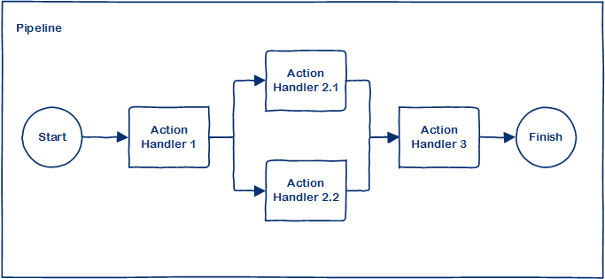
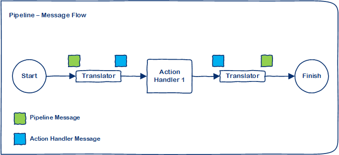

# SPipeline

SPipeline is .Net based pipeline solution with Sequential and Parallel handlers.

## Key Concepts

**Pipeline** - The pipeline is the main execution block which execute connected action handlers in parallel and/or sequential form. 

**Pipeline Parameters** - The request message is the initial parameter to the pipeline; and the response message is final result from pipeline, which could contain the final value and/or error messages.

**Action Handler** - The action handler is the actual unit of code to be executed by the pipeline.

**Action Handler Parameters** - The request is parameter to the action handler; and the response message is result from the action handler, which could contain the final value and/or error messages (similar to pipeline).

**Translator** - The translator function is required to convert pipeline request message to action handler request, and action handler response to pipeline response message.

**Message Dispatcher** - The message dispatcher is a utility class to register and execute pipeline based on the type of message.

## Pipeline Message Flow

## Example - Generic Pipeline

	// Action Request
    public class GenericActionRequest : ActionRequestBase
    {
    }

	// Action Reponse
    public class GenericActionResponse : ActionResponseBase
    {
    }

	// Action Handler
    public class GenericActionHandler<TTranslateRequest, TTranslateResponse>
        : ActionHandlerBase<GenericActionRequest, GenericActionResponse, TTranslateRequest, TTranslateResponse>
        where TTranslateRequest : IMessageRequest
        where TTranslateResponse : IMessageResponse
    {
        public GenericActionHandler(
            Func<TTranslateRequest, GenericActionRequest> requestTranslator,
            Func<GenericActionResponse, TTranslateResponse> responseTranslator)
            : base(requestTranslator, responseTranslator)
        {
        }

        public override GenericActionResponse Execute(GenericActionRequest actionRequest)
        {
            // Custom code
            return new GenericActionResponse();
        }
    }

	// Pipeline Request
    public class GenericPipelineRequest : MessageRequestBase
    {
        public GenericPipelineRequest(bool clearErrorsBeforeNextHandler)
			: base(new PipelineConfiguration
		            {
		                ClearErrorsBeforeNextHandler = clearErrorsBeforeNextHandler
		            })
        {
        }
    }

	// Pipeline Response
    public class GenericPipelineResponse : MessageResponseBase
    {
    }

	// Create pipeline
    var pipeline = new GenericPipeline<GenericPipelineRequest, GenericPipelineResponse>();
	// Add action handler
    pipeline.AddSequential(
        new GenericActionHandler<GenericPipelineRequest, GenericPipelineResponse>(req => new GenericActionRequest(), res => new GenericPipelineResponse()));
	// Execute pipeline
    var response = pipeline.Execute(new GenericPipelineRequest(false));

## Example - Custom Pipeline with Multiple Action Handlers

    // First Action Request
    public class FirstActionRequest : ActionRequestBase
    {
    }

    // First Action Response
    public class FirstActionResponse : ActionResponseBase
    {
    }

    // First Action Handler
    public class FirstActionHandler
        : ActionHandlerBase<FirstActionRequest, FirstActionResponse, CustomPipelineRequest, CustomPipelineResponse>
    {
        public FirstActionHandler()
            : base(source => new FirstActionRequest(), source => new CustomPipelineResponse())
        {
        }

        public override FirstActionResponse Execute(FirstActionRequest actionRequest)
        {
            // Custom code
            return new FirstActionResponse();
        }
    }

    // Second Action Request
    public class SecondActionRequest : ActionRequestBase
    {
    }

    // Second Action Response
    public class SecondActionResponse : ActionResponseBase
    {
    }

    // Second Action Handler
    public class SecondActionHandler<TTranslateRequest, TTranslateResponse>
        : ActionHandlerBase<SecondActionRequest, SecondActionResponse, TTranslateRequest, TTranslateResponse>
        where TTranslateRequest : IMessageRequest
        where TTranslateResponse : IMessageResponse
    {
        public SecondActionHandler(
            Func<TTranslateRequest, SecondActionRequest> requestTranslator,
            Func<SecondActionResponse, TTranslateResponse> responseTranslator)
            : base(requestTranslator, responseTranslator)
        {
        }

        public override SecondActionResponse Execute(SecondActionRequest actionRequest)
        {
            // Custom code
            return new SecondActionResponse();
        }
    }

    // Third Action Request
    public class ThirdActionRequest : ActionRequestBase
    {
    }

    // Third Action Response
    public class ThirdActionResponse : ActionResponseBase
    {
    }

    // Third Action Handler
    public class ThirdActionHandler<TTranslateRequest, TTranslateResponse>
        : ActionHandlerBase<ThirdActionRequest, ThirdActionResponse, TTranslateRequest, TTranslateResponse>
        where TTranslateRequest : IMessageRequest
        where TTranslateResponse : IMessageResponse
    {
        public ThirdActionHandler(
            Func<TTranslateRequest, ThirdActionRequest> requestTranslator,
            Func<ThirdActionResponse, TTranslateResponse> responseTranslator)
            : base(requestTranslator, responseTranslator)
        {
        }

        public override ThirdActionResponse Execute(ThirdActionRequest actionRequest)
        {
            // Custom code
            return new ThirdActionResponse();
        }
    }

    // Custom Pipeline Request
    public class CustomPipelineRequest : MessageRequestBase
    {
        public CustomPipelineRequest(bool clearErrorsBeforeNextHandler)
			: base(new PipelineConfiguration
		            {
		                ClearErrorsBeforeNextHandler = clearErrorsBeforeNextHandler
		            })
        {
        }
    }

    // Custom Pipeline Response
    public class CustomPipelineResponse : MessageResponseBase
    {
    }

    // Custom Pipeline
    public class CustomPipeline : PipelineBase<CustomPipelineRequest, CustomPipelineResponse>
    {
        public CustomPipeline()
        {
            AddSequential(new FirstActionHandler());

            AddParallel(
                new SecondActionHandler<CustomPipelineRequest, CustomPipelineResponse>(
                    source => new SecondActionRequest(),
                    source => new CustomPipelineResponse()),
                new ThirdActionHandler<CustomPipelineRequest, CustomPipelineResponse>(
                    source => new ThirdActionRequest(),
                    source => new CustomPipelineResponse()));

			// Add custom initialization logic...
        }
    }

    var pipeline = new CustomPipeline();
	var response = pipeline.Execute(new CustomPipelineRequest(false));

## Example - Message Dispatcher

    var messageDispatcher = new MessageDispatcher();
    messageDispatcher.RegisterPipeline(new CustomPipeline());
    var response = messageDispatcher.Execute(new CustomPipelineRequest(false));
